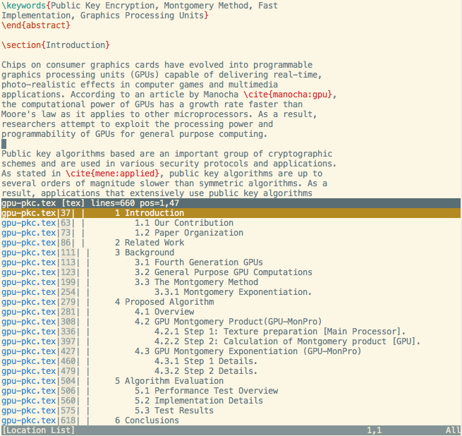

quicktoc-vim
============

Qucktoc-vim generates tables of contents from LaTex and Markdown documents and displays them in the location list window. The location list entries can be selected to quickly jump to the various sections and subsections of the current document.

There are 2 ways to generate the table of contents: commands and key bindings. The commands are:

    :QuickTocLatex
    :QuickTocMarkdown

A quicker way is to hit **\<localleader\> c** when editing a Latex or Markdown document.

This plugin does not have any external dependencies.

Installation
------------

Install [pathogen](https://github.com/tpope/vim-pathogen) and [git](http://git-scm.com/), if not already installed, and then copy and paste the following:

    cd ~/.vim/bundle  
    git clone git://github.com/sf1/quicktoc-vim.git

Screenshot
----------

License
-------

Copyright (C) Sebastian Fleissner. Distributed under the VIM license. See `h license`.
